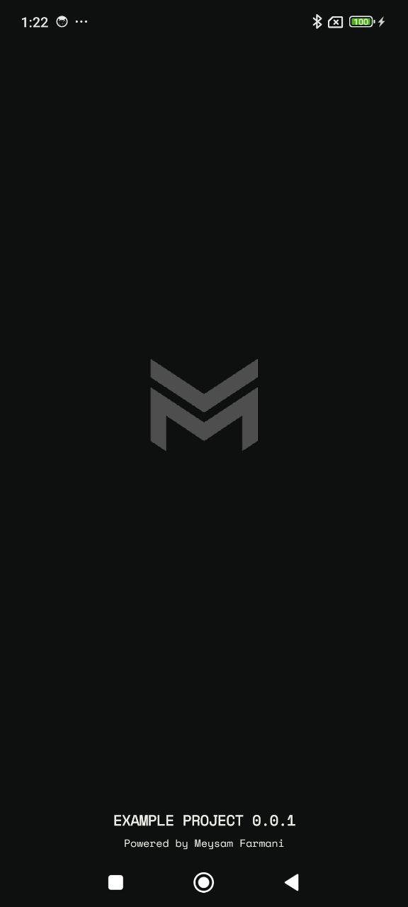
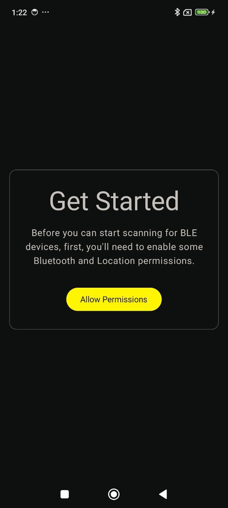
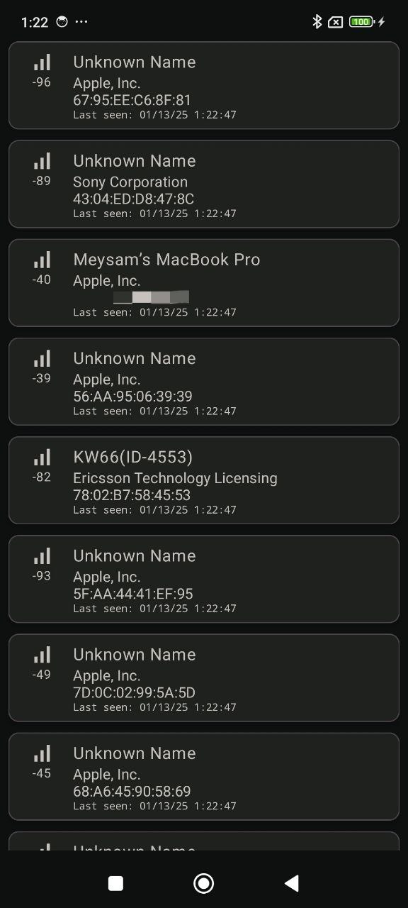
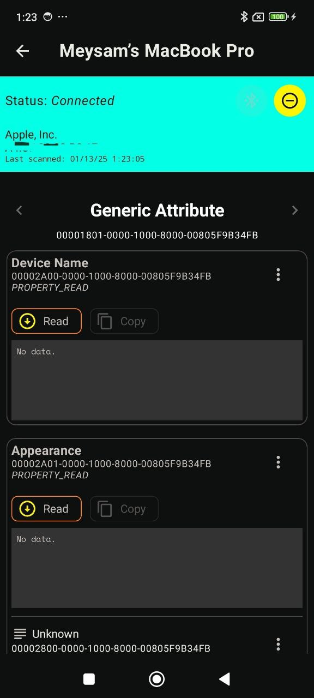

BLE Scanner
===========

A Bluetooth Low Energy (BLE) Scanner app that allows users to scan for BLE devices, connect to a device, view its characteristics, and read or write to those characteristics. The app is built using a modular architecture for better maintainability and scalability.

Features
--------

1.  **Permissions Handling**:
    -   Before scanning, ensure the required permissions are granted.
2.  **Device Scanning**:
    -   Displays a list of nearby BLE devices.
3.  **Device Connection**:
    -   Tap on a device to establish a connection.
4.  **Characteristics Interaction**:
    -   View device characteristics.
    -   Read or write data to supported characteristics.

* * * * *

Libraries and Tools Used
------------------------

The BLE Scanner app leverages the following libraries and tools:

-   **Jetpack Compose**: For building a modern, declarative UI.
-   **Dagger Hilt**: For dependency injection and modular architecture.
-   **Bluetooth GATT API**: For managing BLE scanning, connections, and communication.
-   **Kotlin Coroutines**: For managing asynchronous tasks and flows.
-   **Material Design Components**: For a user-friendly and aesthetically pleasing interface.
-   **Timber**: For advanced logging and debugging.

* * * * *

Usage
-----

1.  Launch the app.
2.  Grant the required permissions when prompted.
3.  Start scanning to discover nearby BLE devices.
4.  Tap on a device to connect.
5.  View its characteristics and choose to read or write data.

## Screenshots

### 1. Splash Screen

### 2. Permissions Screen

### 3. Device Scanning Screen

### 4. Characteristics Screen

